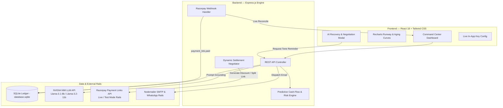

<div align="center">

# ⚡ CashFlow AI
### Autonomous Accounts Receivable & AI-Powered Revenue Recovery Command Center
 Track 3: AI Revenue Recovery**

[](https://razorpay.com)
[](https://build.nvidia.com)
[](https://react.dev)
[](https://nodejs.org)
[](#)
[](#-zero-config-instant-demo-mode)

<br/>

> **CashFlow AI turns passive Razorpay payment links into an active, autonomous revenue recovery engine.**  
> It bridges **predictive cash-flow forecasting**, **autonomous LLM recovery agents (NVIDIA NIM)**, and **dynamic Razorpay payment settlements** to eliminate cash crunches before revenue slips through the cracks.

<br/>


</div>

---

## 📑 Table of Contents
- [💡 The Problem & The Solution](#-the-problem--the-solution)
- [🎯 Hackathon Track: AI Revenue Recovery](#-hackathon-track-ai-revenue-recovery)
- [✨ Key Features](#-key-features)
- [🏗️ System Architecture](#️-system-architecture)
- [⚡ Zero-Config Instant Demo Mode](#-zero-config-instant-demo-mode)
- [🚀 Step-by-Step Setup Guide](#-step-by-step-setup-guide)
  - [Prerequisites](#prerequisites)
  - [1. Clone Repository](#1-clone-repository)
  - [2. Backend Setup](#2-backend-setup)
  - [3. Database Seeding](#3-database-seeding)
  - [4. Frontend Setup](#4-frontend-setup)
- [⚙️ Environment Configuration](#️-environment-configuration)
- [🔌 API Endpoints Reference](#-api-endpoints-reference)
- [🤖 AI Engine & NVIDIA NIM Architecture](#-ai-engine--nvidia-nim-architecture)
- [💳 Razorpay Payment Rails & Webhooks](#-razorpay-payment-rails--webhooks)
- [📂 Project Directory Layout](#-project-directory-layout)
- [🛡️ Verification & Testing Scenarios](#️-verification--testing-scenarios)
- [🤝 Contributing & License](#-contributing--license)

---

## 💡 The Problem & The Solution

### 🔻 The Problem
Small businesses, creative agencies, and freelancers lose up to **30% of their annual working capital** to delayed client invoices and collections fatigue:
1. **Passive Payment Links**: Merchants create payment links, send them once, and wait passively.
2. **Manual Chasing Drain**: Finance teams waste 15+ hours weekly manually reviewing spreadsheets and typing awkward reminder emails.
3. **Rigid Payment Terms**: When clients face liquidity crunches, an all-or-nothing invoice causes complete payment default.

### 🟢 The CashFlow AI Solution
CashFlow AI acts as a **24/7 autonomous financial recovery manager**:
- **Dynamic Aging & Runway Analytics**: Real-time visualization of accounts receivable aging buckets and projected 30-day cash inflows.
- **Autonomous AI Recovery Agent**: Context-aware, 3-tier tone-escalated reminders generated via **NVIDIA NIM LLMs** (Friendly → Formal → Urgent).
- **Agentic Smart Settlements**: Generates dynamic **2% Quick-Pay incentives** or **50/50 Milestone Split Links** on Razorpay to unlock stuck liquidity.
- **Instant Webhook Reconciliation**: Real-time event simulation and ledger reconciliation upon payment completion.

---

## 🎯 Hackathon Track: AI Revenue Recovery

CashFlow AI was engineered specifically for **Track 3: AI Revenue Recovery**:
- **Proactive Risk Intervention**: Evaluates payment health across all pending receivables and computes a dynamic Cash-Flow Risk Index.
- **Autonomous Negotiation**: Solves liquidity deadlocks via agentic payment link restructuring.
- **End-to-End Recovery Loop**: From aging detection $\rightarrow$ intelligent notification dispatch $\rightarrow$ payment collection on Razorpay rails $\rightarrow$ real-time ledger settlement.

---

## ✨ Key Features

| Feature | Description | Tech Powering It |
| :--- | :--- | :--- |
| **📊 Real-Time AR Dashboard** | Live metrics for Overdue Receivables, 30-Day Due Pipeline, and Risk Score. | React, Recharts, SQLite |
| **📈 Predictive Inflow Curves** | 30-day cumulative collection trajectory & aging breakdown charts. | Recharts Area & Pie Visualizers |
| **🤖 3-Tier Tone Escalation Agent** | Automatically chooses the optimal tone (Friendly / Firm / Urgent) based on invoice days overdue. | NVIDIA NIM (`meta/llama-3.1-8b-instruct`) |
| **⚡ Dynamic Razorpay Settlements** | Auto-provisions discounted links (2% quick-pay) or splits large invoices into two 50/50 milestone links. | Razorpay Node SDK & Payment Links API |
| **🟢 Real-Time Webhook Simulator** | Simulates live `payment_link.paid` webhook events and reconciles ledger state without page reloads. | Express Webhook Engine & Atomic Transactions |
| **📬 Multi-Channel Dispatch** | 1-click live Gmail SMTP dispatch, pre-filled Gmail Web compose, and WhatsApp messaging links. | Nodemailer + Google App Passwords |
| **🛡️ Bulk Receivables Audit** | Single-click holistic analysis of all accounts receivable with an AI-authored executive action plan. | NVIDIA NIM High-Context Processing |
| **⚙️ In-App Credentials Manager** | Live switch between Mock Mode and Real Razorpay/NVIDIA API keys directly from the UI header. | Custom Header Interceptors |

---

## 🏗️ System Architecture



---

## ⚡ Zero-Config Instant Demo Mode

> **CashFlow AI works 100% out of the box with ZERO API keys required!**  
> If no credentials are provided in `.env`, the system automatically activates **High-Fidelity Mock Mode**, simulating:
> - Realistic Razorpay payment links and hosted checkout flows
> - Built-in intelligent reminder generation algorithms
> - Simulated webhook settlements with instant UI reconciliation
> 
> *When you supply your **NVIDIA API Key** or **Razorpay Test Keys**, it seamlessly upgrades to live production APIs!*

---

## 🚀 Step-by-Step Setup Guide

Follow these simple steps to run CashFlow AI locally on **Windows**, **macOS**, or **Linux**.

### Prerequisites
- **Node.js** (v18.0.0 or higher) — [Download Node.js](https://nodejs.org/)
- **npm** (comes with Node.js) or **yarn** / **pnpm**
- **Git** installed

---

### 1. Clone Repository
```bash
git clone https://github.com/SidakSethi-Singh/razorpay_buildthon_cash_flow.git
cd razorpay_buildthon_cash_flow
```

---

### 2. Backend Setup
Open your terminal and navigate to the `backend` folder:
```bash
cd backend
npm install
```

#### Optional: Configure Environment Variables
Copy the sample environment file:
```bash
cp .env.example .env
```
*(On Windows PowerShell: `Copy-Item .env.example .env`)*

Edit `.env` if you have live API keys (otherwise leave defaults for Instant Mock Mode):
```env
PORT=5000
RAZORPAY_KEY_ID=your_razorpay_test_key_id
RAZORPAY_KEY_SECRET=your_razorpay_test_key_secret
NVIDIA_API_KEY=your_nvidia_nim_api_key
SMTP_USER=your_email@gmail.com
SMTP_PASS=your_16_char_google_app_password
```

---

### 3. Database Seeding
Populate your SQLite database with realistic merchant accounts receivable, overdue invoices, and client profiles:
```bash
npm run seed
```
*Output will confirm creation of overdue invoices across multiple aging tiers (0-3 days, 4-10 days, 10+ days).*

#### Start Backend Server:
```bash
npm start
```
> 🚀 **Backend running at:** `http://localhost:5000`

---

### 4. Frontend Setup
Open a **new terminal window** and navigate to the `frontend` folder:
```bash
cd frontend
npm install
```

#### Start Frontend Dev Server:
```bash
npm run dev
```
> 🌐 **Frontend running at:** `http://localhost:5173`

Open `http://localhost:5173` in your browser to explore the CashFlow AI Command Center!

---

## ⚙️ Environment Configuration

| Variable | Required? | Default / Fallback | Description |
| :--- | :---: | :--- | :--- |
| `PORT` | No | `5000` | Port for Express backend server |
| `RAZORPAY_KEY_ID` | Optional | `Mock Links` | Razorpay Key ID (`rzp_test_...`) for real payment links |
| `RAZORPAY_KEY_SECRET` | Optional | `Mock Mode` | Razorpay Key Secret |
| `NVIDIA_API_KEY` | Optional | `Rule-based Engine` | NVIDIA NIM API Key (`nvapi-...`) for LLM collection agent |
| `SMTP_USER` | Optional | `Disabled` | Gmail address for live 1-click email reminders |
| `SMTP_PASS` | Optional | `Disabled` | 16-character Google App Password |

> 💡 **Tip**: You can also enter or update API keys **directly within the web UI** under the **"AI Configurations"** tab without restarting the server!

---

## 🔌 API Endpoints Reference

### Accounts Receivable & Analytics
- `GET /api/payments` — Retrieve all receivables with dynamic aging and status.
- `GET /api/cashflow-summary` — Calculate overdue totals, 30-day runway projection, and Cash-Flow Risk Index.
- `POST /api/payments` — Create a new receivable with automatic Razorpay link generation.

### Autonomous Recovery Agent (NVIDIA NIM)
- `GET /api/generate-reminder/:id` — Generate a tone-escalated reminder grounded on invoice metadata.
- `POST /api/refine-reminder` — Refine existing draft with natural language instructions (e.g. *"Make it more diplomatic"* or *"Add a 24-hr deadline"*).
- `POST /api/generate-bulk-nudges` — Scan all pending receivables and return an executive recovery action plan.

### Smart Settlements & Webhooks
- `POST /api/create-smart-settlement` — Generate dynamic 2% Quick-Pay discount links or 50/50 milestone splits.
- `POST /api/payments/webhook-simulate` — Simulate a Razorpay `payment_link.paid` webhook event and trigger atomic ledger settlement.
- `POST /api/send-email` — Dispatch reminder directly to client via Gmail SMTP.

---

## 🤖 AI Engine & NVIDIA NIM Architecture

CashFlow AI utilizes **NVIDIA NIM** (National Institute of Standards and Technology-compliant high-throughput microservices) using models like `meta/llama-3.1-8b-instruct` and `meta/llama-3.2-11b-vision-instruct`.

```
               ┌──────────────────────────────────────────────┐
               │         Client Receivables Record            │
               │  (Client, Amount, Days Overdue, Due Date)    │
               └──────────────────────┬───────────────────────┘
                                      │
                                      ▼
               ┌──────────────────────────────────────────────┐
               │          Deterministic Tone Router           │
               ├──────────────────────────────────────────────┤
               │  0–3 Days Overdue  ➜ Tier 1: Friendly Nudge  │
               │  4–10 Days Overdue ➜ Tier 2: Formal Notice   │
               │  10+ Days Overdue  ➜ Tier 3: Urgent Warning  │
               └──────────────────────┬───────────────────────┘
                                      │
                                      ▼
               ┌──────────────────────────────────────────────┐
               │              NVIDIA NIM Prompt               │
               │     Grounded with Razorpay Payment Link      │
               └──────────────────────┬───────────────────────┘
                                      │
                                      ▼
               ┌──────────────────────────────────────────────┐
               │    High-Conversion Actionable Recovery Email │
               └──────────────────────────────────────────────┘
```

---

## 💳 Razorpay Payment Rails & Webhooks

1. **Payment Links API**: Programmatically creates payment links with customer identifiers, descriptions, expiry reminders, and notification flags.
2. **Dynamic Settlements**:
   - **2% Quick-Pay Link**: Incentivizes immediate settlement by reducing invoice amount by 2% for 24 hours.
   - **50/50 Split Links**: Dynamically creates Part 1 (immediate) and Part 2 (14-day net) Razorpay links to unblock stalled cash flow.
3. **Webhook Reconciliation**: Employs an event-driven handler that verifies signatures, updates SQLite transaction status, and triggers live UI recalculation.

---

## 📂 Project Directory Layout

```
razorpay_buildthon_cash_flow/
├── README.md                      # Comprehensive project documentation
├── screenshots/                   # UI demo visual assets
│   ├── razorpay_theme_demo.webp
│   └── tabs_interactivity_demo.webp
│
├── backend/                       # Express + Node.js API Service
│   ├── .env.example               # Environment variables template
│   ├── database.sqlite            # Embedded SQLite transaction ledger
│   ├── db.js                      # Database connection & schema setup
│   ├── package.json               # Backend dependencies
│   ├── seed.js                    # Demo receivables seeding script
│   └── server.js                  # Core API controller, NIM & Razorpay integrations
│
└── frontend/                      # React 18 + Vite + Tailwind CSS
    ├── index.html                 # HTML entry point
    ├── package.json               # Frontend dependencies
    ├── tailwind.config.js         # Razorpay custom color palette & design tokens
    ├── vite.config.js             # Vite bundler configuration
    └── src/
        ├── App.jsx                # Main CashFlow AI Command Center interface
        ├── index.css              # Global styles & design system
        └── main.jsx               # React mount root
```

---

## 🛡️ Verification & Testing Scenarios

Want to test all workflows in under 2 minutes? Try these quick scenarios:

1. **Test AI Tone Escalation**:
   - Click **"AI Recovery"** on an invoice overdue by 2 days $\rightarrow$ Notice the polite, relationship-first tone.
   - Click **"AI Recovery"** on an invoice overdue by 15 days $\rightarrow$ Notice the urgent tone with escalation notice.
2. **Test Agentic Prompt Refinement**:
   - In the AI modal, type: *"Offer a 5% discount if paid today"* $\rightarrow$ Watch the AI rewrite the email with the offer and payment link intact.
3. **Test Smart Settlement Links**:
   - Select **"50/50 Split Settlement"** $\rightarrow$ Observe two distinct milestone links created on the fly.
4. **Test Live Webhook Reconciliation**:
   - Click **"Simulate Paid Webhook"** $\rightarrow$ Watch the invoice turn green (`PAID`), the overdue balance drop instantly, and the Cash Flow Risk Score recalculate live!

---

## 🤝 Contributing & License

  
Licensed under the [MIT License](LICENSE).

<div align="center">
  <sub>Accelerating cash flow, one automated recovery at a time.</sub>
</div>
